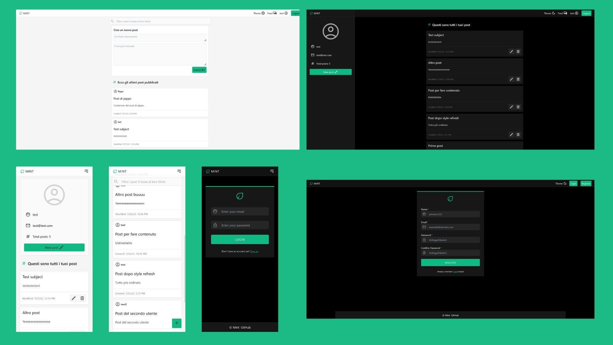

# Progetto finale Start2Impact

## Live URL

[Clicca qui per provare l'app](https://s2ifullstack.web.app/)

(Usa le credenziali **test@test.com/password** o crea un nuovo utente)

## Descrizione

Il progetto prevede la creazione di un'app Full-Stack che implementi un sistema di autenticazione e delle API REST.

### Cosa ho utilizzato

Front End:

- Angular
- TailwindCSS
- Material Icons
- Firebase (deploy)

Back End:

- Laravel (API)
- Laravel Sanctum (Autenticazione)
- Laravel Fortify (Login, Registrazione)
- PostgreSQL
- Heroku (deploy)

### Cosa ho costruito

Ho creato un'applicazione che prende spunto dal noto subreddit "Shower Thougts", dove un utente può registrarsi e scrivere brevi post di varia natura.

#### Struttura

Grazie alla struttura SPA è possibile visualizzare tutti i contenuti sulla homepage, filtrarli o crearne di nuovi. Nel proprio profilo è possibile modificare, cancellare e visualizzare i propri post, nonché visionare i propri dati personali. Ogni post mostra anche data di creazione o modifica, insieme ad autore e contenuto. Per questo fine ho sfruttato gli strumenti di Angular e RxJS come Reactive Forms, Behavior Subjects ed Event Emitter.

#### Utilizzo di TypeScript

Non meno importante, TypeScript è stato implementato in modo approfondito per controllare ogni tipo di dato che sia in chiamata o risposta, in modo da non dover utilizzare variabili "any", con l'ausilio anche di tipi e interfacce custom. Inoltre, i componenti si preoccupano solo di mostrare i dati, tutta la logica di business è affidata ai servizi.

#### Sistema di autenticazione

Originariamente il progetto prevedeva (e resta configurato) per utilizzare la sessione di PHP e i cookie con Laravel Sanctum. Questo metodo però funziona solo se il progetto è caricato su un solo server e dispone di diversi sottodomini. Per questo motivo, ho scelto infine di utilizzare un sistema di token, sempre offerti da Laravel Sanctum, che permettono di autenticare le chiamate.

#### Guards

Il flusso di navigazione è gestito dall'autenticazione: una volta autenticati è possibile visitare il feed e il proprio profilo, ma non le pagine di login e registrazione. Viceversa, queste due sarnno disponibili senza aver effettuato l'accesso, ma il resto sarà bloccato.

#### Db

Il database è stato interamente gestito attraverso Laravel grazie agli strumenti di migrazione e query building, sfruttando Controllers e Models. Originariamente MySQL, una volta in produzione ho utilizzato PostgreSQL.

#### Design

L'app è totalmente responsive e include anche uno switch per il tema chiaro/scuro che, oltre a rispettare la scelta dell'utente, di default si basa sulle preferenze di sistema. Il design è moderno, semplice ed è stato ampiamente ispirato dagli strumenti che TailwindCSS mette a disposizione. Non mancano feedback all'utente nei form e nelle pagine.

## Implementazioni future

Nice to have:

- Controllo del profilo utente (immagine, cambio mail, password e username)
- Sistema di like/dislike
- Commenti

Da rivedere:

- Chiamate asincrone da limitare

## Testare il progetto in locale

Clonare il repo, creare un db e settare la variabili d'ambiente sia per Angular che per Laravel. I due framework vanno avviati su porte diverse (default 4200 e 8000) per comunicare in localhost.
